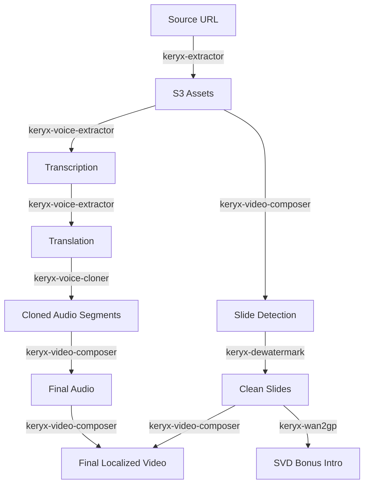

# 🏛️ Keryx - Automated Video Localization Pipeline

Named after the Ancient Greek herald (κῆρυξ), the inviolable messenger of truth. **Keryx** is an automated, event-driven pipeline designed to convert technical presentation videos into localized and re-stylized versions with frame-accurate precision.

The system ensures that complex technical content remains accurate while the visual aesthetic and the speaker's original voice are preserved and adaptively translated to target linguistic matrices.

## 🎯 Objective
Automate the end-to-end localization of YouTube presentation videos, including:
- **Slide Analysis**: Frame-accurate detection of slide transitions using `ffmpeg` scene detection.
- **Audio Transcription**: High-fidelity STT using **Faster-Whisper**.
- **Contextual Translation**: Preservation of technical terms via **Ollama (Llama 3)**.
- **Visual Stylization**: Slide regeneration using **Stable Diffusion (ControlNet)**.
- **Voice Cloning** (Phase 3): **Coqui XTTS v2** for speaker voice preservation.
- **Video Composition**: **MoviePy** for final assembly and time-stretching.

## 🏗️ Technical Architecture
Keryx is built using **Hexagonal Architecture** (Ports & Adapters) in Rust to ensure strict isolation between domain logic and infrastructure (S3, Redis, AI endpoints).

### 🧡 Interfaces
- **Web UI**: A modern "Cyberpunk/Glassmorphism" interface inspired by the **Kusanagi** aesthetic, featuring real-time job status tracking and GITS-inspired visuals.
- **REST API**: Axum-based endpoints for job creation (`/api/jobs`) and health monitoring (`/health`).

### 💙 Domain logic
- **Job Entity**: State machine-driven job lifecycle (Downloading → Analyzing → Transcribing → Translating).
- **Assets Map**: Mapping detected slide frames to their corresponding transcribed segments for accurate localized overlays.

### 💛 Infrastructure (Adapters)
- **Job Repository**: Redis-backed persistence using **DragonflyDB**.
- **Storage Repository**: S3-compatible asset management via **MinIO** (Path-style addressing).
- **Video Pipeline**: `yt-dlp` (piloted with Node.js runtime) and `ffmpeg`.

## 🚀 High-Performance Async Architecture
Keryx is designed for maximum throughput and minimal resource footprint on the `jo3` cluster:
- **Zero-Blocking Runtime**: All external process calls (`FFmpeg`, `yt-dlp`) are handled via **Tokio Asynchronous Processes**, ensuring the execution engine never blocks.
- **Streamed Analysis**: `FFmpeg` scene detection logs are streamed line-by-line via asynchronous buffers, preventing OOM crashes even with high-resolution 4k video analysis.
- **VRAM Optimizations**: The **Diffusion Engine** utilizes `model_cpu_offload` and `attention_slicing` to stay within GPU limits while processing SDXL Turbo stylization.
- **Resilience**: Decoupled `yt-dlp` acquisition logic handles YouTube `429 (Too Many Requests)` for subtitles by automatically falling back to high-fidelity AI transcription.

## 📡 API Usage
The Keryx pipeline is accessible via a robust REST API:

### 1. Create a Localization Job
```bash
curl -X POST https://keryx.p.zacharie.org/api/jobs \
  -H "Content-Type: application/json" \
  -d '{
    "video_url": "https://www.youtube.com/watch?v=PsPqWLoZaMc",
    "target_langs": ["fr", "es"],
    "prompt": "Cyberpunk glassmorphism style, vibrant neon highlights"
  }'
```

### 2. Monitor Job Status
```bash
curl https://keryx.p.zacharie.org/api/jobs/{job_id}
```
*Possible states: `Pending` → `Downloading` → `Analyzing` → `Transcribing` → `Translating` → `GeneratingVisuals` → `Completed` | `Failed`.*

## 🛠️ Configuration
Keryx is optimized for cluster environments using these variables:
```bash
REDIS_URL=redis://:PASSWORD@dragonfly.dragonfly.svc:6379
S3_BUCKET=keryx
S3_ENDPOINT=https://minio-170-api.zacharie.org
DIFFUSION_URL=http://diffusion-engine.keryx.svc:8000
WHISPER_URL=http://192.168.0.194:9000
OLLAMA_URL=http://192.168.0.191:11434
```

## 📜 Repository Structure
```
.
├── services/
│   └── orchestrator/         # Core Rust service (Axum)
├── deploy/
│   └── helm/             # Kubernetes localized charts
├── TEST_PLAN.md          # Verification strategy
└── README.md
```

## 🌊 Distributed Orchestration Workflow

The Keryx orchestrator manages a complex sequence of AI workers, scaling them up and down dynamically to optimize VRAM and CPU usage on the cluster.



### Worker Execution Sequence:

1.  **keryx-extractor** (Phase 1): Downloads source video and audio to S3.
    *   *Dependencies*: Network, S3.
2.  **keryx-voice-extractor** (Phase 2): Generates high-fidelity transcription using Faster-Whisper.
    *   *Dependencies*: NVIDIA GPU (VRAM), S3.
3.  **keryx-video-composer** (Phase 3): Analyzes video to detect frame-accurate slide transitions.
    *   *Dependencies*: S3.
4.  **keryx-dewatermark** (Phase 3B): Removes watermarks and UI clutter from detected slides using AI.
    *   *Dependencies*: NVIDIA GPU, S3.
5.  **keryx-voice-extractor** (Phase 4): Translates segments to the target language preserving context.
    *   *Dependencies*: Ollama (Llama 3).
6.  **keryx-voice-cloner** (Phase 4B): Generates localized audio segments using the speaker's cloned voice (XTTS v2).
    *   *Dependencies*: NVIDIA GPU (High VRAM), S3.
7.  **keryx-video-composer** (Phase 4C/5): Concatenates audio segments and performs final video assembly (synced overlay).
    *   *Dependencies*: S3.
8.  **keryx-wan2gp** (Phase 6): Generates a cinematic AI intro animation (SVD) for the first slide.
    *   *Dependencies*: NVIDIA GPU (High VRAM).

## 🚦 Status: 🟢 Production Ready (Phase 1 & 2)
The orchestrator unit and Diffusion Engine are fully operational on GPU-enabled nodes (`vm169`), capable of end-to-end video localization with AI-driven visual re-styling and multilingual transcription.

---
*Powered by Rust, Ollama, Whisper, and the Ancient Greek spirit.*
