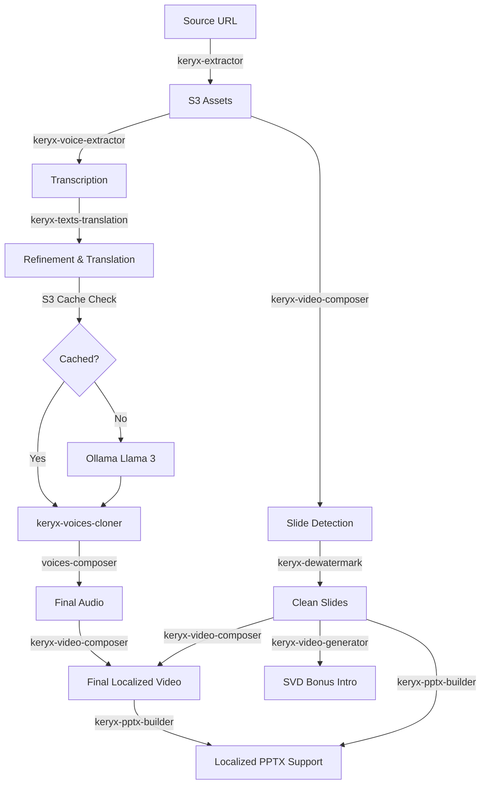

# 🏛️ Keryx - Automated Video Localization Pipeline

Named after the Ancient Greek herald (κῆρυξ), the inviolable messenger of truth. **Keryx** is an automated, event-driven pipeline designed to convert technical presentation videos into localized and re-stylized versions with frame-accurate precision.

The system ensures that complex technical content remains accurate while the visual aesthetic and the speaker's original voice are preserved and adaptively translated to target linguistic matrices.

## 🎯 Objective
Automate the end-to-end localization of YouTube presentation videos, including:
- **Slide Analysis**: Frame-accurate detection of slide transitions using `ffmpeg` scene detection.
- **Audio Transcription**: High-fidelity STT using **Whisper Medium** (upgraded for Keryx-Voice).
- **Contextual Translation & Refinement**: Preservation of technical terms and linguistic smoothing via **keryx-texts-translation** (Ollama/Llama 3) with **MinIO S3 idempotent caching**.
- **Visual Stylization**: Slide regeneration using **Stable Diffusion (ControlNet)**.
- **Voice Cloning**: **Coqui XTTS v2** and **GPT-SoVITS** for speaker voice preservation.
- **Video Composition**: **voices-composer** and **keryx-video-composer** for final assembly.
- **Presentation Export**: **keryx-pptx-builder** to generate localized PowerPoint supports.

## 🏗️ Technical Architecture
Keryx is built using **Hexagonal Architecture** (Ports & Adapters) in Rust to ensure strict isolation between domain logic and infrastructure (S3, Redis, AI endpoints).

### 🧡 Interfaces
- **Web UI**: A modern "Cyberpunk/Glassmorphism" interface inspired by the **Kusanagi** aesthetic, featuring real-time job status tracking and GITS-inspired visuals.
- **REST API**: Axum-based endpoints for job creation (`/api/jobs`) and health monitoring (`/health`).

### 💙 Domain logic
- **Job Entity**: State machine-driven job lifecycle (Downloading → Analyzing → Transcribing → Translating → Cloning → Composing → PPTX).
- **Assets Map**: Mapping detected slide frames to their corresponding transcribed segments for accurate localized overlays.

### 💛 Infrastructure (Adapters)
- **Job Repository**: Redis-backed persistence using **DragonflyDB**.
- **Storage Repository**: S3-compatible asset management via **MinIO** (Path-style addressing).
- **Video Pipeline**: `yt-dlp` (piloted with Node.js runtime) and `ffmpeg`.

## 🎙️ Voices Lab (Standalone Audio Pipeline)
In addition to full video localization, Keryx features a **Voices Lab** for testing the audio-only pipeline. This is accessible via the sidebar and allows:
- Standalone transcription testing.
- Text refinement and LLM-driven translation.
- Direct voice cloning from source audio using **GPT-SoVITS**.
- Audio concatenation for podcast-like outputs.

## 🚀 High-Performance Async Architecture
Keryx is designed for maximum throughput and minimal resource footprint on the `jo3` cluster:
- **Zero-Blocking Runtime**: All external process calls (`FFmpeg`, `yt-dlp`) are handled via **Tokio Asynchronous Processes**, ensuring the execution engine never blocks.
- **WorkerGuard (RAII Scaling)**: Orchestrator utilizes a scoped `WorkerGuard` pattern in Rust to automatically trigger `scale_up` and `scale_down` on GPU nodes, ensuring resources are released even during failure.
- **Idempotent S3 Caching**: Translation and refinement results are hashed and cached in the `keryx-cache` bucket (MinIO), drastically reducing Ollama load for repetitive jobs.
- **Streamed Analysis**: `FFmpeg` scene detection logs are streamed line-by-line via asynchronous buffers, preventing OOM crashes even with high-resolution 4k video analysis.
- **Cinematic Intro Integration**: Systematic integration of `begin.mp4` with a 1s freeze and a 2s crossfade transition.
- **Resilience**: Decoupled `yt-dlp` acquisition logic handles YouTube `429 (Too Many Requests)` for subtitles by automatically falling back to high-fidelity AI transcription.

## 📡 API Usage
The Keryx pipeline is accessible via a robust REST API:

### 1. Create a Localization Job
```bash
curl -X POST https://keryx.p.zacharie.org/api/jobs \
  -H "Content-Type: application/json" \
  -d '{
    "video_url": "https://www.youtube.com/watch?v=PsPqWLoZaMc",
    "target_langs": ["fr", "es"],
    "prompt": "Cyberpunk glassmorphism style, vibrant neon highlights"
  }'
```

### 2. Monitor Job Status
```bash
curl https://keryx.p.zacharie.org/api/jobs/{job_id}
```
*Possible states: `Pending` → `Downloading` → `Analyzing` → `Transcribing` → `Translating` → `GeneratingVisuals` → `CloningVoice` → `Composing` → `Completed` | `Failed`.*

## 🛠️ Configuration
Keryx is optimized for cluster environments using these variables:
```bash
REDIS_URL=redis://:PASSWORD@dragonfly.dragonfly.svc:6379
S3_BUCKET=keryx
S3_ENDPOINT=https://minio-api.zacharie.org
EXTRACTOR_URL=http://keryx-extractor:8000
VOICE_EXTRACTOR_URL=http://keryx-voice-extractor:8000
TEXTS_TRANSLATION_URL=http://keryx-texts-translation:8000
VOICE_CLONER_URL=http://keryx-voices-cloner:8000
VOICE_CLONER_GPT_URL=http://keryx-voice-cloner-gpt:8000
VOICES_COMPOSER_URL=http://voices-composer:8000
PPTX_URL=http://keryx-pptx-builder:8000
OLLAMA_URL=http://ollama.svc.cluster.local:11434
```

## 📜 Repository Structure
```
.
├── services/
│   ├── orchestrator/         # Core Rust service (Axum)
│   ├── texts-translation/    # Python Translation & Refinement service
│   ├── voice-extractor/      # Whisper STT worker
│   └── ...
├── deploy/
│   └── helm/             # Kubernetes localized charts
├── TEST_PLAN.md          # Verification strategy
└── README.md
```

## 🌊 Distributed Orchestration Workflow

The Keryx orchestrator manages a complex sequence of AI workers, scaling them up and down dynamically to optimize VRAM and CPU usage on the cluster.



### Worker Execution Sequence:

1.  **keryx-extractor** (Phase 1): Downloads source video and audio to S3.
2.  **keryx-voice-extractor** (Phase 2): Generates high-fidelity transcription using Faster-Whisper.
3.  **keryx-video-composer** (Phase 3): Analyzes video to detect frame-accurate slide transitions.
4.  **keryx-dewatermark** (Phase 3B): Removes watermarks and UI clutter from detected slides using AI.
5.  **keryx-texts-translation** (Phase 4): Refines transcription and translates segments using LLMs.
6.  **keryx-voices-cloner / GPT** (Phase 4B): Generates localized audio segments using cloned voice (XTTS v2 / GPT-SoVITS).
7.  **voices-composer** (Phase 4C): Concatenates audio segments.
8.  **keryx-video-composer** (Phase 5): Performs final video assembly with synced overlays and cinematic intro.
9.  **keryx-video-generator** (Phase 6): Generates a cinematic AI intro animation (SVD) for the first slide.
10. **keryx-pptx-builder** (Phase 7): Builds localized PowerPoint presentations from detected slides.

## 🚦 Status: 🟢 Production Ready
The orchestrator unit and full AI pipeline are fully operational on GPU-enabled nodes (`vm169`), capable of end-to-end video localization with AI-driven visual re-styling and multilingual transcription.


---
*Powered by Rust, Ollama, Whisper, and the Ancient Greek spirit.*
